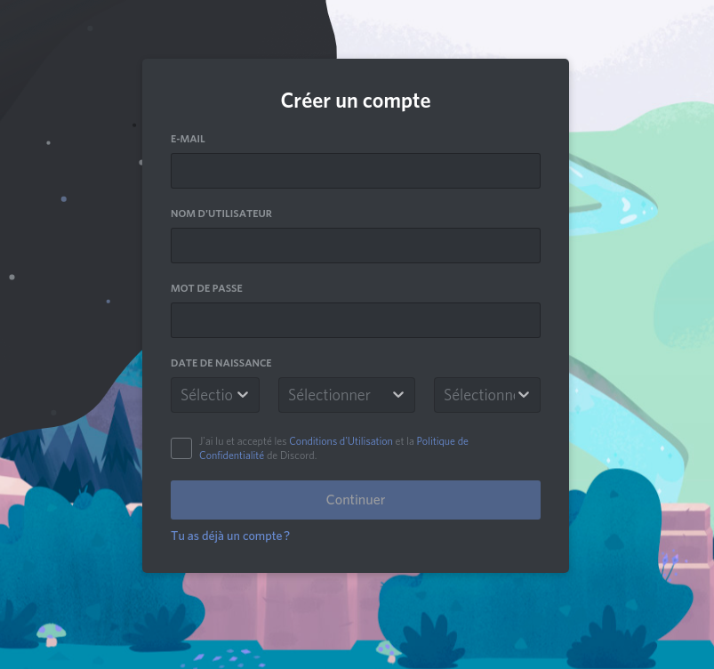
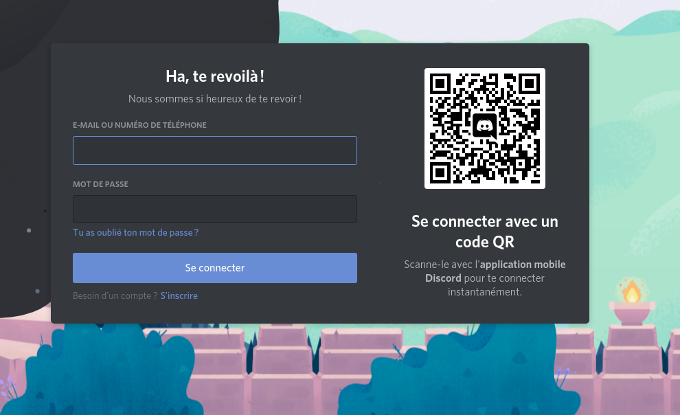

# Tutoriel synthétique sur Discord
## Informations sur ce tutoriel
### Auteur(s)
|Auteur|Fonction|Organisme|Département|
|:------|:-------:|:-------:|:---------:|
|Thomas LEYSENS | IR | Université Gustave Eiffel | AME |

### Document
|Version|Dernière MàJ|
|:-----:|:----------:|
|0.1|07 mai 2021|

### Enjeux
> Nous verrons comment installer et utiliser les services de [Discord](https://fr.wikipedia.org/wiki/Discord_(logiciel)).

> ***Ceci est un court tutoriel pour créer un compte et mettre en place un serveur privé, n'hésitez pas à vous renseigner plus en détails sur Discord et plus globalement sur l'utilisation sécurisée d'application pour éviter tout désagrément, notamment en consultant un guide complet dont le lien se trouve dans dans la section [Liens utiles](#liens-utiles). Nous nous contenterons de faire quelques précisions et de vous renvoyer sur le support officiel quand cela convient pour faciliter l'usage de Discord.***

Discord a d'abord été pensé pour la communauté "gamers", ne vous étonnez donc pas de l'utilisation du tutoiement et de l'utilisation de références "jeux vidéo" dans les tutoriels du support Discord que nous mentionnerons. Cette plateforme est néanmoins de plus en plus utilisée par la communauté des développeurs informatiques, entre autres, notamment à cause de sa facilité d'accès. 

Il s'agit ici de présenter rapidement Discord, de créer un compte puis de créer un serveur privé (*afin de pouvoir le contrôler plus facilement et de le protéger des accès extérieurs, ce qui est recommandé pour un usage professionnel*).

Voici le lien officiel pour créer un compte, télécharger l'application (*disponible sous Linux, Windows, macOS, iOS, Android*) ou lancer Discord via son navigateur:
* https://discord.com/
* [Liens de téléchargement pour toutes les versions](https://discord.com/download)

En effet, Discord peut s'utiliser dans le cadre de ses applications ou via un navigateur.

## Présentation brève
Discord est un logiciel de VoIP (*voix par IP*):

> *La voix sur IP, ou « VoIP » pour « Voice over IP », est une technologie informatique qui permet de transmettre la voix sur des réseaux compatibles IP, via Internet ou des réseaux privés (intranets) ou publics, qu'ils soient filaires (câble/ADSL/fibre optique) ou non (satellite, Wi-Fi et réseaux mobiles).
(source: [Wikipedia](https://fr.wikipedia.org/wiki/Voix_sur_IP))*

Discord prétend avoir pour ambition de donner une solution concurrente présentée comme plus simple et gratuite (*dans sa version accessible à tous*) aux solutions existantes comme Skype ou TeamSpeak, entre autres. Ce sont des affirmations à prendre avec précaution puisqu'une entreprise ne se risquera pas à présenter son produit comme moins bon ou défectueux.

Discord permet:
* d'échanger des messages textes avec les membres d'un serveur et de salons
* d'échanger des documents (*si les paramètres du serveur l'autorise mais ce n'est pas conseillé*) de moins de 8Mo (*version gratuite*)
* de discuter via des salons vocaux avec ou sans visio
* de proposer des flux vidéo (*partage d'écran*)
* d'échanger des liens (*vérifier toujours d'où provient le lien et ne cliquez pas si vous n'êtes pas certain de sa fiabilité*)
* d'échanger éventuellement quelques lignes de code pour dépanner car Discord support en partie la syntaxe MarkDown (*cf. [Liens utiles](#liens-utiles) pour plus de détails sur cette syntaxe très simple à prendre en main*)

## Utilisation
### Avertissement
Comme le dit l'adage populaire, "*si c'est gratuit, c'est que vous être le produit*" (*même si cela n'est pas présenté comme tel par l'entreprise produisant le logiciel*). Discord semble avoir comme modèle économique des offres payantes (*offrant plus de possibilités*) et une offre gratuite sans limitation de temps pour attirer les utilisateurs sur leurs solutions logicielles. Cela ne signifie pas qu'ils ne récoltent aucune donnée sur leurs utilisateurs quelque soit la version utilisée, d'autant que les conditions d'utilisation peuvent évoluer avec le temps.

Vous êtes donc invités, avant de créer un compte -et cela vaut pour n'importe quelle application ou n'importe quel logiciel- et d'utiliser l'application (*vous devrez accepter les conditions d'utilisation ainsi que la politique de confidentialité pour pouvoir vous inscrire et utiliser l'application*), à vous référer aux:
* [Conditions d'utilisation](https://discord.com/terms)
* [Politique de confidentialité](https://discord.com/privacy)
* [Charte d'utilisation](https://discord.com/guidelines)
* [Mesures de sécurité](https://discord.com/safety)

Il doit être rappelé ici que toutes les mesures de sécurité prises par Discord ou via votre système d'exploitation ne vous protégera d'une mauvaise utilisation.
Donc veillez à:
* Prenez garde à ce que vous partagez en ligne et préférez des solutions sécurisées (*comme celles proposées par Renater par exemple*) pour partager des documents/informations sensibles étant donné que vous n'avez pas un contrôle absolu sur les serveurs Discord
* Ne téléchargez pas des éléments dont vous ne connaissez pas la provenance ou qui vous paraissent suspects
* Evitez de partager des informations confidentielles, sensibles ou personnelles sur des applications telles que Discord
* Ne pas oublier que l'anonymat n'existe quasiment pas quand vous naviguez (*à moins de prendre certaines mesures drastiques*) et ne pas le confondre avec le pseudonymat.

***De manière générale, vérifiez bien ce que vous téléchargez en passant par les liens officiels et que vous êtes sur les stores officiels et/ou sur une adresse correcte en https***.

### Compte
#### Création
Rendez-vous sur la [page d'inscription](https://discord.com/register):
* 
* Il est conseillé de renseigner une adresse email plutôt qu'un numéro de téléphone
* Nous vous conseillons de choisir un mot de passe robuste:
	* [conseils de sécurité concernant les mots de passe](https://www.ssi.gouv.fr/guide/mot-de-passe/)
	* [quelques gestionnaires de mot de passe](https://korben.info/keepass-logiciel-gestion-mots-passe.html). Keepass est open source et peut être utilisé localement avec enregistrement des mots de passes dans une base de données protégée elle-même par un mot de passe (**à retenir sous peine de ne plus pouvoir accéder à la base de donnée**) dans un fichier.
* Il vous sera demandé d'accepter les conditions d'utilisation et la politique de confidentialité (**il est fortement conseillé d'en prendre connaissance**)
* Vous recevrez un mail de la part de Discord pour confirmer votre inscription. Discord ne sera accessible qu'après avoir accepté.

***Nous vous conseillons de mettre en place une [double authentification](https://support.discord.com/hc/fr/articles/219576828-Mise-en-place-de-l-authentification-%C3%A0-deux-facteurs) pour plus de sécurité. Choisissez ce qui vous convient le mieux en termes de praticité/sécurité/vie privée***

#### Connexion
> [Support Discord pour la connexion](https://support.discord.com/hc/en-us/articles/360057027354-How-to-Login-to-your-Account)

Lors d'une première connexion sur un appareil inconnu de Discord, il vous sera demandé d'effectuer une vérification si vous avez établi la double authentification.

Vous disposez essentiellement de 2 méthodes pour vous connecter:
* entrez votre identifiant et votre mot de passe
* [scannez un QR code](https://support.discord.com/hc/en-us/articles/360039213771) depuis l'application Discord pour smartphone et suivez simplement les étapes. Cette méthode a l'avantage de ne pas devoir taper son mot de passe. ***ATTENTION: ne jamais scanner un QR code que vous n'avez pas généré vous-même en vous rendant sur l'application.***

### Serveur(s)
> Nous aborderons ici essentiellement les serveurs privés (*uniquement accessibles sur invitation*).

> Pour échanger avec un ou plusieurs membres simplement, il est possible d'engager un canal spécifique de conversation pour autant que des échanges existent entre eux dans un salon ou qu'ils soient "amis" (*cela peut varier en fonction des configurations des salons et des serveurs*). Vous pouvez ajouter des "amis" en suivant [cette procédure](https://support.discord.com/hc/fr/articles/218344397-Comment-ajouter-mes-copains-%C3%A0-ma-liste-d-amis-). 

#### Rejoindre
Vous pouvez rejoindre un serveur depuis une invitation d'un "ami Discord" ou depuis un lien d'invitation (*qui peut être soumis à une limite d'utilisation et une date de validité donc il se peut que le lien expire au bout d'un certain temps. Les invitations peuvent aussi concerner uniquement certains salons en fonction du rôle - voir la section [Rôles](#rôles) qui vous sera attribué*).

#### Création
> [Support Discord pour la création d'un serveur](https://support.discord.com/hc/fr/articles/204849977-Comment-cr%C3%A9er-un-serveur-)

Nous vous invitons à suivre le support indiqué ci-dessus. 

Il nous faut préciser que le choix de localisation du serveur peut avoir des conséquences en termes de législation, donc prenez garde à votre choix et, par défaut, il semble plus prudent de choisir un serveur en France. 

##### Rôles / Permissions
> [Support Discord pour les rôles et les permissions](https://support.discord.com/hc/fr/articles/206029707-Comment-configurer-les-Permissions-)

> [Support Discord pour la création de rôles](https://support.discord.com/hc/fr/articles/214836687-Gestion-des-r%C3%B4les-101)

> [Tutoriel vidéo pour créer un serveur privé et des rôles "administrateur" et "modérateur"](https://support.discord.com/hc/fr/articles/211056628--Vid%C3%A9o-Cr%C3%A9er-un-Admin-un-Modo-et-des-Salons-Priv%C3%A9s-avec-les-Permissions-Discord)

Comme précédemment, veuillez suivre la documentation citée ci-dessus. 

Ce n'est pas une obligation mais il apparaît plus simple de créer des rôles pour gérer votre serveur et les nouveaux membres. Vous pouvez en effet attribuer des permissions très précises par membre concernant sa liberté d'action sur le serveur et sur les salons (*vous pouvez limiter l'accès à certains salons à certains membres*) et ainsi cloisonner les espaces.   
  
On peut, par exemple, imaginer un espace d'échange spécifique pour le groupe d'administration du serveur ainsi que de larges permissions qui ne seront pas attribuées aux membres de base. Cela permet de donner des autorisations spécifiques aux membres qui maîtrisent la technologie et qui sont prêts à agir concernant les mesures d'administration et de sécurité. 

Nous vous conseillons de prêter une attention particulière concernant les permissions concernant:
* le partage de liens et leur prévisualisation
* le partage de fichiers (*il est plutôt conseillé de désactiver ce partage par mesure de sécurité*)
* les possibilités d'administration du serveur et des salons (*à réserver aux membres avec un rôle d'administration*). ***Prenez bien garde à ces autorisations car elles peuvent mener à des erreurs ou à des conséquences très fâcheuses si elles sont mal utilisées***:
	* inviter de nouveaux membres
	* changer des permissions
	* modifier des rôles 
	* modifier la configuration du serveur et des salons
	* ...  
	
Par défaut, le créateur du serveur conserve tout pouvoir sur le serveur. Il faut donc que ce dernier ait un compte très bien protégé (*mot de passe fort, double authentification, ...*).

***Nous vous rappelons qu'il ne faut pas vous reposer entièrement sur Discord pour un projet étant donné que des erreurs ou des changements peuvent survenir. Il convient plutôt d'utiliser ce service uniquement pour faciliter les discussions de groupe***

Concernant la sécurité, il est possible de refuser l'accès aux utilisateurs n'ayant pas activé la double authentification pour sécuriser de manière plus poussée l'accès au serveur. Cela peut rendre un peu plus contraignant l'accès mais peut vous éviter de mauvaises surprises si un compte utilisateur s'est vu piraté ou s'avère corrompu. 

#### Salons
> [Support Discord pour la création de salon de base](https://support.discord.com/hc/fr/articles/115001580171-Cat%C3%A9gories-de-salons-la-Base)

> [Support Discord pour la création de salon privé](https://support.discord.com/hc/fr/articles/206143877-Comment-configurer-un-salon-pour-un-r%C3%B4le-exclusif-)

Veuillez vous référer aux liens ci-dessus. 

Dans le cadre de salons privés, le plus simple est de gérer cela via les rôles (*comme exposé dans le [lien ci-dessus](https://support.discord.com/hc/fr/articles/206143877-Comment-configurer-un-salon-pour-un-r%C3%B4le-exclusif-)*). 

Il est conseillé de détailler le but du salon dans sa description (*appelée "sujet", cf. image ci-dessous*) afin de faciliter et d'informer les nouveaux utilisateurs arrivant sur ce salon. 

#### Inviter
> [Support Discord pour invitation "instantanée"](https://support.discord.com/hc/fr/articles/208866998-Invitation-instantan%C3%A9e-101)
> [Support pour inviter des "amis"](https://support.discord.com/hc/fr/articles/204155938-Comment-inviter-des-amis-%C3%A0-mon-serveur-)

Référez-vous aux liens ci-dessus. 

## Liens utiles
* [Tutoriel pour débutants sur le support Discord](https://support.discord.com/hc/fr/articles/360045138571-Guide-de-Discord-pour-d%C3%A9butants)
* [Bonnes pratiques de l'Agence nationale de sécurité des systèmes d'information (ANSSI)](https://www.ssi.gouv.fr/entreprise/bonnes-pratiques/), voir aussi le [compte Twitter du CERT (Centre gouvernemental de veille, d'alerte et de réponse aux attaques informatiques)](https://twitter.com/CERT_FR) pour des alertes régulières.
* [Références MarkDown](https://github.com/adam-p/markdown-here/wiki/Markdown-Cheatsheet)
